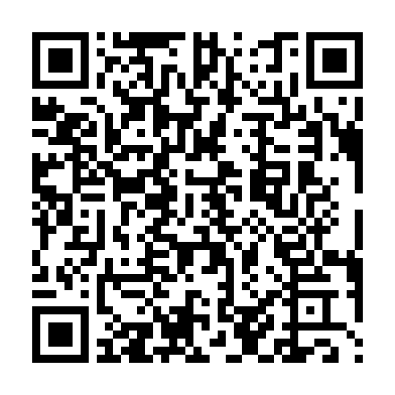

[Download als PDF](README.pdf)  
[Download als Word (DOCX)](README.docx)

# Voorstel uitstap naar Chevetogne

Gelet op de eerdere successen en op het feit dat Margaux en Maxime elk jaar vragen om eens naar Chevetogne te gaan doe ik jullie graag het volgende voorstel.

Er zijn twee opties:

- ~~2 daagse trip: 15/08 en 16/08.~~
- 3 daagse trip: 15/08, 16/08 en 17/08.

**EDIT: Er werd gekozen door alle ouders voor de 3 daagse trip.

De reden waarom de 3 daagse opgekomen is heeft te maken met de prijsschaling voor de toegang tot het park en ook met de rij afstand van 2.5 uur (+-).

De bestemming is dus een gigantisch provinciaal domein in de provincie Namen waar we twee of drie dagen zouden verblijven. Wat ik hoop is dat de kinderen voor een lange tijd gewoon kind kunnen zijn en spelen. Ik kleed alles zodanig in dat er ook veel gewandeld word en dat ze wat zon op hun vel hebben (wel beperkt indien die heel fel is rond het midden van de dag.)

Omdat Margaux en Maxime dat leuk vinden nodig ik graag Elise en Lucas uit om mee te gaan. Mijn rol is om jonge mensen te helpen om zich te ontwikkelen in de plaats van ze tegen te houden. Dus ik ga gewoon met de auto rijden, eten voorzien en organiseren. Dus dit jaar zou ik inderdaad 4 kids meenemen. Voor de twijfelaars: Dat is minder werk dan je zou denken want ze houden elkaar bezig.

Het plan is simpel: We hangen gewoon twee of drie dagen hoofdzakelijk in dat park uit en rond de airBNB. Geen tablets maar wel speelgoed, boeken etc.

## De bestemming: Chevetogne

Meer informatie:

- 360 interactive webpagina Geschikt voor apparaten met groter scherm:
  [https://360.domainedechevetogne.be/](https://360.domainedechevetogne.be/)

- Algemene informatie in het Frans:
  [https://www.domainedechevetogne.be/](https://www.domainedechevetogne.be/)

Dit provinciaal domein is groot en biedt veel verschillende speeltuinen en wandelmogelijkheden. Daarnaast zijn er activiteiten mogelijk die gratis zijn eens de inkom van het park betaald is:

- Grote variëteit aan speelterreinen
- Buitenzwembad
- Kayak/Roeiboot op stilstaand water
- Mini golf
- Musea
- Kinderboerderij
- Terassen voor volwassenen waar enige waardigheid kan herwonnen worden (Verfrissingen voor mijn rekening).

Omdat toegang beperkt en omdat de prijs in de zomer niet triviaal is beschouw ik het park als veilig, proper en relatief vrij van problematische individuen en zogenaamde 'jongeren'. Dat is in overeenstemming met mijn eerdere ervaringen.

## De accommodatie

Voorstel airBNB: [The Dear Deer](https://www.airbnb.be/rooms/53829803?check_in=2025-08-15&check_out=2025-08-17&guests=1&adults=1&children=4&s=67&unique_share_id=47f5c5cc-2728-4cd7-8807-e1b505030f64)

Ik vind het belangrijk dat elke setje kids een eigen kamer krijgt en dat de accommodatie proper is. Ikzelf slaap wel in de zetel. Zolang er koffie is ben ik quasi onsterfelijk.

De chalet heeft kookfaciliteiten, comfortabele bedden en een badkamer.

## Maaltijden

- Eerste dag: Picknick in het park voorzien door mij. Ik kook zelf eten in chalet die avond
- Middenste dag (niet van toepassing op 2 daagste): Idem als de eerste dag
- Laatste dag: Picknick opnieuw. 's Avonds frituurtje or pizza op de weg terug.

Ik hou alles koel met frigobox op verplaatsing omdat ik liefst proteïnerijke en vettige voeding aanbied aan de kinderen.

## Pratkisch

Omdat er gekozen werd voor de 3 daagse trip kunnen we het schema relaxed houden zodat jong en oud niet te vroeg moeten opstaan.

Voeg het event toe aan je kalendar met [deze link)[event.ics].

Ophalen en vertrek: 15/08/2025 om 09:00.
Terugkomst: 18/08/2025 om 18:00 met één uur marge.

## De kosten

Voor het park: Het voordeligst is om een 'familiepas' te nemen per voertuig (geldig voor alle inzittenden en voor het hele jaar). Dat kost 130 euro.
De kost voor het park komt neer op 26 euro per kind voor 3 dagen.

Voor het verblijf: Volgens airBNB is de kost voor de accommodatie 96 euro per nacht voor iedereen. Daarbij komen de vaste schoonmaak kosten en de service kosten die variabel zijn. In de tabel hieronder staat de kost per kind zoals aangegeven door airBNB. De kost per kind word bekomen door de totale kost te delen door 5.

Voor het eten: Ik reken op 10 euro per kind per dag voor eten. We gaan vooral picknicken en eten uit de supermarkt waar mogelijk. Ik reken op één ijsje en één drankje ter plaatse ook maar dergelijke budget overruns neem ik voor mijn rekening.

Voor het transport: De brandstofkosten worden berekend op basis van de afstand en een verbruik van 6.5 liter benzine per 100 kilometer aan 1.5 EUR per liter. Ik reken alleen de rij afstand tussen Blankenberge en het park. Meerkost is voor mijn rekening.

---

Kosten in EURO

| Formule  | Kost accommodatie | Kost toegang park | Supplement maaltijd | Transport | Totaal per kind | Totaal kind/dag |
| -------- | ---------------- | ----------------- | ------------------- | --------- | --------------- | --------------- |
| 3 Daagse | 50               | 26                | 30                  | 10        | 116             | 39              |

Dus voor twee kinderen totaal in EURO.

| Formule  | Totale kost voor 2 kinderen |
| -------- | --------------------------- |
| 3 Daagse | 232                         |

Totale kost van de tip voor 4 kinderen en mezelf met berekening ter controle (in EURO).

| Formule  | Totale kost berekening                           | Totale kost | Totale kost per persoon |
| -------- | ------------------------------------------------ | ----------- | ----------------------- |
| 3 daagse | 130(park) + 254(verbl.) + 150(eten) + 50(trans.) | 584         | 116                     |

Omdat ikzelf met het plan op de proppen kwam bied ik elk gezin een korting aan van **20%**.

---

Gelet op het feit dat één gezin gescheiden is maak ik nog het volgende totale overzicht (in EURO).

Voor 3 daags voorstel TOTAAL:

| Formule  | Partij    | Kostprijs | Kostprijs met korting |
| -------- | --------- | --------- | --------------------- |
| 3 daagse | Elsbeth   | 116       | **92**                |
| 3 daagse | Tom       | 116       | **92**                |
| 3 daagse | Fam. BOON | 232       | **185**               |

QR Code voor Tom en Elsbeth:

QR Code voor Familie BOON.

Alternatief is juiste bedrag storten op: `BE92 7795 9319 2723` met mededeling 'Betaling 3 daagse'.

## Mee te nemen

Per kind zou het goed zijn mochten jullie de volgende dingen voorzien:

- Kledij
  * [ ] 1x Korte broek of afritsbroek geschikt voor de zomer
  * [ ] 1x Trui lange mouwen; geen gebreide of delicate stof.
  * [ ] 1x Hardshell jas ('regenjas') die waterafstotend is
  * [ ] 3x T-shirt; niet kostbaar
  * [ ] 3x onderbroek
  * [ ] 3x paar kousen
  * [ ] Schoenen* [ ]
  * [ ] Reserve schoenen (ouder paar)
  * [ ] 1x badpak/zwembroek/bikini
  * [ ] Extra shortje om in te slapen of pyjama (geen airco in BNB dus lichte slaapkledij)
  * [ ] Een pet om hoofd en ogen te beschermen tegen de zon
  * [ ] Optioneel: zwembril
  * [ ] Optioneel: zonnebril (liever niet; word vaak misplaatst dus pet is beter)
- Accessoires
  * [ ] Haarborstel voor de meisjes
  * [ ] Tandenborstel
  * [ ] Compacte microvezel handdoek (indien geen beschikbaar dan voorzie ik één)
  * [ ] Waterfles
- Overige
  * [ ] Kids-ID (identiteitsbewijs)
  * [ ] Indien van toepassing: medicatie (e.g. histamine voor allergieën)
  * [ ] Slaapzakje en kussen (bedlinnen niet voorzien in de accommodatie)
  * [ ] Rugzak (daypack; niet te groot)
  * [ ] Autozitje zodat elk kind reglementair en veilig in de auto kan zitten
  * [ ] Optioneel: 1 Knuffel maximum. Extra knuffels worden ritueel verbrand in een intieme plechtigheid onder gregoriaans gezang in E-mineur.
  * [ ] Optioneel: 1 Stuk speelgoed maximum (playmobil, pop, RC voertuig, ...)

Algemene opmerkingen:

* Géén sandalen of modieuze laarsjes of andere niet functionele schoenen. Kinderen moeten kunnen klimmen. Bij voorkeur ademend, lage hiel en flexibel met brede tenendoos. Ik vermeld dit specifiek omdat vele meisjesschoenen een ramp zijn om mee te sporten en klimmen.
* Zowel meisjes als jongens broek en T-shirt. Geen jurkjes. Ik hou er niet van om te zien dat als de meisjes op speeltoestellen zitten dat ze dan helemaal onbedekt zijn in sommige houdingen. De kledij heeft op een actieve dag ook een (UV-)beschermende functie.
* Indien de jonge mensen zich modieus willen maken dan kan dit het beste met een leuk shirtje en accessoires zoals een armbandje.
* Géén tablets mee. Indien een smartphone mee gaat dan zal ik deze persoonlijk bij houden. Ze krijgen veel vrijheid op sommige aspecten maar op anderen niet. Ik verwacht dat ze moeite doen om harmonieus met elkaar om te gaan; ook wanneer dat iets lastiger is. Voor 2 of 3 dagen moeten ze zichzelf vestrooien met hun verbeelding of met elkaar eerder dan zichzelf verdoven met een apparaat.

Ikzelf breng de volgende dingen mee waar alle kinderen gebruik van kunnen maken:

- Beschermen
  * EHBO kit: aspirine, wondverband, zuurstofwater, ontsmettingsmiddel, ...
  * Zonnecrème factor 50
- Organisatie
  * Plastic zakken groot en klein
  * Klein beetje wasmiddel
- Voeding
  * Alle benodigdheden voor picknick; bestek voor allen
  * Alle benodigdheden om te koken in het chalet + wat kruiden
  * Koelbox
  * Gepaste, suikerarme, dranken en picknick voor dag 1; voor de overige dagen word er ter plaatse geshopt
- Entertainment
  * Compacte gezelschapspelen
  * Laptop en HDMI kabel voor streamen van een leuke film waar alle kinderen samen naar kunnen kijken
  * Enkele strips en boeken
  * Teken- en kleurmateriaal
- Hygiëne en extra
  * Enkele fleece dekens
  * Extra handdoeken
  * Shampoo en douchecreme
  * Washandjes
  * Powerbank

## Extra Informatie

* Laat mij weten indien een kind allergieën heeft en welke voeding moet vermeden worden indien van toepassing
* Indien van toepassing kun je een document meegeven met een telefoonnummer voor de familiale verzekering mocht er iets gebeuren
* Ikzelf zal er een punt van maken om altijd bereikbaar te zijn behalve tijdens zwem activiteiten (smartphone niet bij)
* Een ouder kan op elk moment hun kind contacteren door mij op te bellen
* Zoals altijd zal een Whatsapp groep opgericht worden als foto repository en voor semi real-time verslaggeving
* Ik verwacht dat de kinderen een douche nemen na een actieve dag. Zichzelf wassen doen ze zo veel mogelijk zelfstandig; zeker de oudsten. De kinderen krijgen privacy in de badkamer tenzij er iets kan verkeerd lopen (e.g. gevaarlijk warme douche, medisch issue, ...) of in uitzonderlijke gevallen (e.g. scatologische ramp).
* In tegenstelling tot de uitstapjes die één dag duren zullen de kinderen voldoende tijd krijgen om te rusten en te slapen. Ze zullen wel fysiek erg actief zijn.
* Indien er nog vragen zijn stuur/bel mij gerust op +32 471 99 61 66 (Whatsapp, telefoon, SMS) of [mijn e-mail](mailto:dennis.vaneecke@gmail.com).

